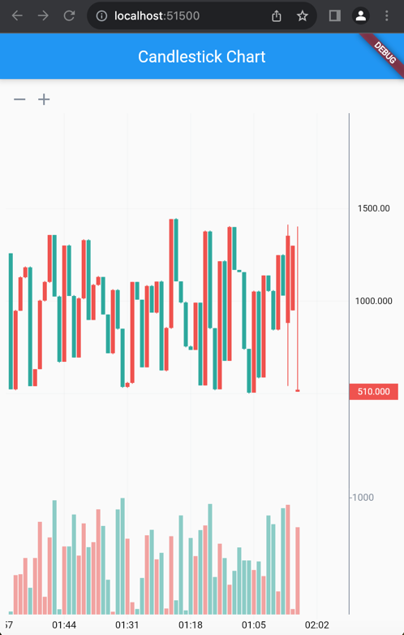
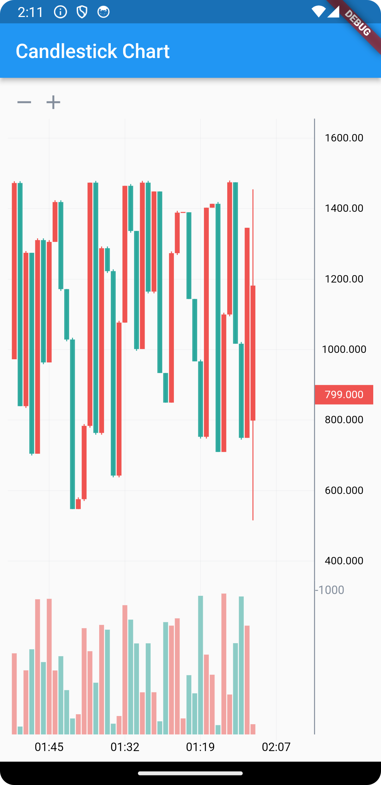

# Candlestick Chart App

This Flutter application displays a candlestick chart that mimics stock market data. It generates random OHLC (Open, High, Low, Close) values for candlesticks and updates them periodically. The app utilizes the `candlesticks` Flutter package to render the chart.

## Features

- Real-time candlestick updates: The app continuously generates new candlesticks with random OHLC values every minute.
- Latest price visualization: The chart also displays the latest price tick, updating every second.

## Screenshots


### web screenshot

### mobile app screenshot

## Recordings


## Getting Started

### Prerequisites

- Flutter SDK installed on your machine
- Any compatible IDE or code editor (e.g., Visual Studio Code, Android Studio)

### Installation

1. Clone this repository or download the source code:
   ```
   git clone https://github.com/YOUR-USERNAME/YOUR-REPOSITORY
   ```
2. Open the project in your preferred IDE or code editor.
3. Run the following command in the project directory to download the dependencies:
   ```
   flutter pub get
   ```
4. Run the app on a connected device or simulator using the following command:
   ```
   flutter run
   ```

## Implementation Details

The app architecture follows the Flutter best practices, with separate classes for the main widget and data service.

### `data_service.dart`

- `FakeDataService`: This class generates random OHLC values and emits them through `Stream` controllers.
- `Candle` class: Represents a single candlestick with its OHLC values.

### `main.dart`

- `MyHomePage`: The main widget that displays the candlestick chart.
- `FakeDataService
